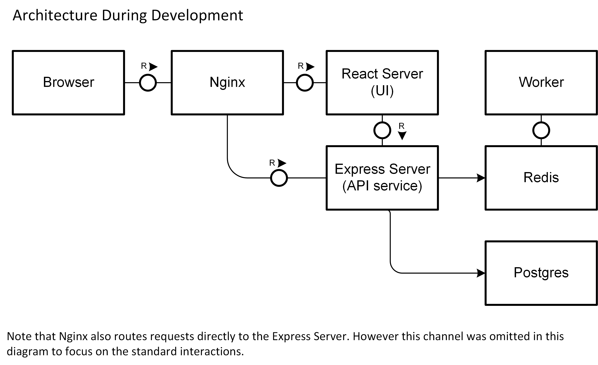

# Architecture

# Docker Compose
`docker-compose.yml` is currently configured to take in a the database secret via the start-up command.
## Examples
WINDOWS (Powershell)
```
$env:POSTGRES_PASSWORD="mypassword";docker-compose up
```
MAC / LINUX
```
POSTGRES_PASSWORD=mypassword docker-compose up
```
An alternative to providing secrets via the start command can be [docker secrets](https://docs.docker.com/compose/compose-file/#secrets).